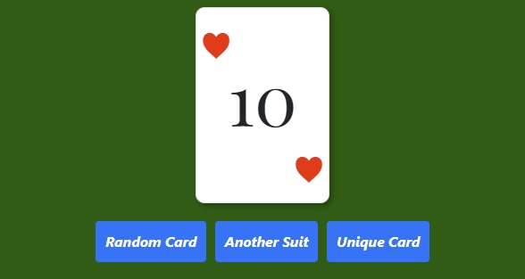

  

------------

# Random Card Dealer

## JavaScript DOM exercises

##### Made by Rodrigo Carvalho

------------

### Project:
 
It's a random card dealer with three functions:
- By clicking the "Random Card" button, the dealer gives to you a fully random card;
- By clicking the "Another Suit" button, the dealer gives to you a card with a different suit in comparison with the actual card;
- By clicking the "Unique Card" button, the dealer gives to you a new unique card until the end of the deck.

  

------------

### How to run the code?:
1. Install the npm packages: `$ npm install`;
1. Build the application: `$ npm run start`.

------------

Exercises made during the **Full Stack Developer Coding Bootcamp** at **4Geeks Academy**